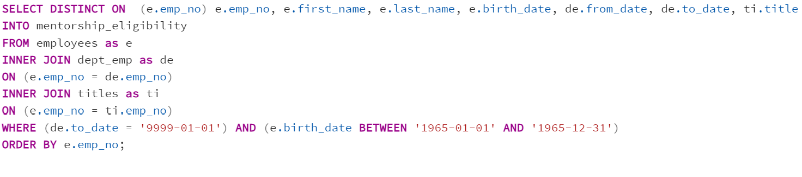

# Pewlett-Hackard(PH)-Analysis
---
## Overview/Results
The Purpose of this New Analysis is Twofold:
---
1. The Number of Retiring Employees by Title
   * Using the ERD created during the completion of the asynchronous module as a reference, combined with our knowledge of SQL queries, the point of this analysis was to create a Retirement Titles table that holds all the titles of current employees who were born between January 1, 1952 and December 31, 1955. Further, since some employees may have multiple titles in the database--for example, due to promotions--the DISTINCT ON clause was used to create a table containing only the most recent title of each employee. Lastly, the COUNT function was used to create a final table, based on the table just mentioned above, which displays the total number of employees set to retire in the near future for each department. This table was created to allow PH executives to gauge approx. how many employees are set to retire from each department. 
   * Moreover, having this table allows PH executives to appropriately plan, and execute any preventitive action necessary to avoid any of their departments from experience declines in productivity due to a shortage of staff. The final table was created using the following queries:
#### Query One: Creating a table that displays all employees eligible for retirement

  * The above query creates a table containing all employees eligible for retirement as per the parameters specified to us by the assignment instructions. 
  * I believe I have identified an issue with the above query as it relates to the end-goal of deliverable #1. The query above--while it does return a list of all employees who meet the retirement eligibility criteria and removes any duplicate employee instances that could have arisen from an employee being promoted (as seen in query two below)--does not seem to account for employees who meet the retirement eligibility criteria, (being born within a certain period) but have already retired. However, I have structured the query in compliance with the step-by-step instructions set out in the assignment. Therefore, the final table, which displays the number of employees set to retire per department, must be inaccurate because it is including employees born within the specified period who have already retired.
#### Query Two: Use the DISTINCT ON clause on the table created above

#### Query Three: Writing another query to retrieve the number of employees by their most recent job title who are about to retire

#### Sample of Final Table: Output from Query Three

---
2. The Employees ELigible for the Mentorship Program
  * The point of this part of the analysis was to create a mentorship-eligibility table which   holds the current employees who were born between January 1, 1965 and December 31, 1965.
  * Having this table allows PH executives to gauge approx. how many employees qualify for     their mentorship eligibility program idea. Further, the table enables them to appropriately plan for and identify any departments that may not possess enough eligible mentors. Thereby, enabling them to come up with a solution ahead of time so that business operations can continue to run smoothly (opposed to what would have happened without this querying) when the time comes to implement this program. The final table was created using the following query:

  * The following image displays a sample of the output returned from executing the above query:

---
## Summary
#### Question One Response
* The amount of roles that will need to be filled as the "silver tsunami" begins to make an impact will depend on exactly how many of the employees we have identified through the above analysis actually retire and when they decide to do so. However, from a high-level, it seems certain that all of the employees we have identified will need to replaced eventually. Overall, I guess the answer to this question depends on how "begins" is defined. 
#### Additional Query #1:

  * The above query is the same three queries executed above as part of the first deliverable. However, it has been refactored by simply changing the filter to cover just one year (as seen from the dates highlighted above the blue underlines). This query should help further answer the above question because it returns only the oldest of the employees posied to retire by defining "begins" as all of the employees presumably set to retire first based on their age.
#### Question Two Response
* Well, assuming that all of the qualified, retirement-ready employees in the PH departments agree to participate in the mentorship program, and if each of them were to mentor 1-2 employees they work with, their should logically be enough mentors to mentor the next generation of PH employees.
#### Additional Query #2
Another query that may provide more insights into the upcoming "silver tsunami" is a query that would return the number of retirement-eligible employees from each department set to retire each year. However, for this to work, the assumption would need to be made that each eligible-retiree will retire in accordance with all the other current employees that are the same age as them. 
